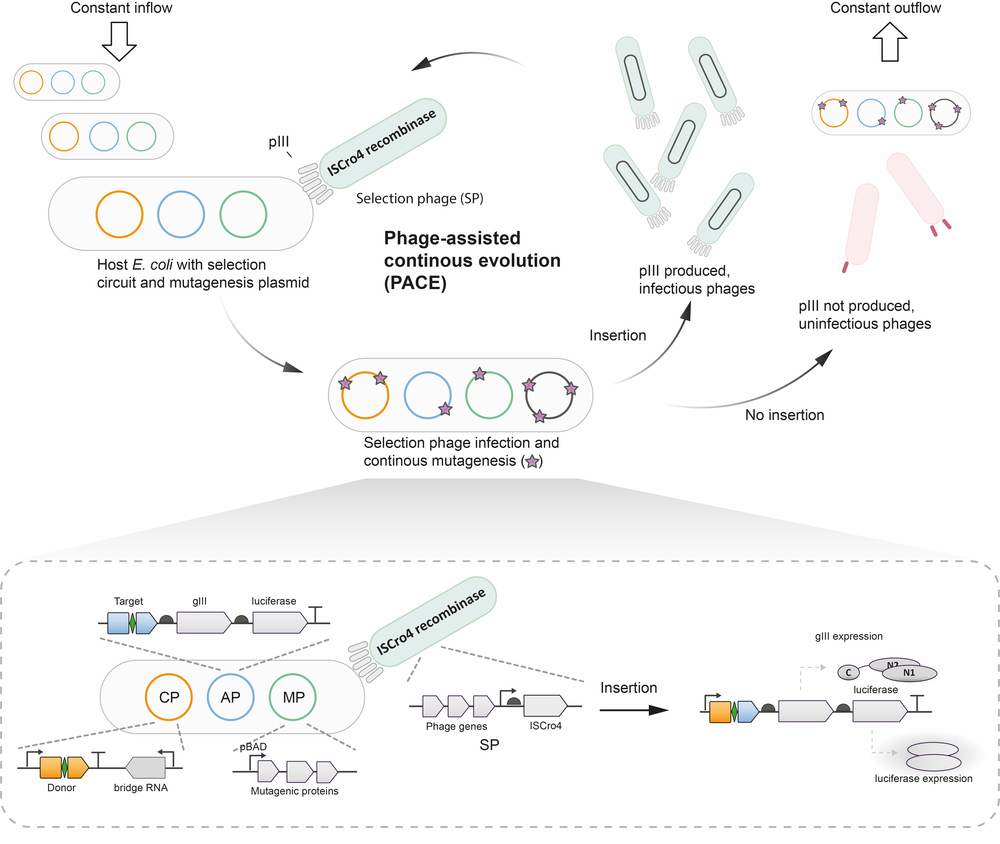
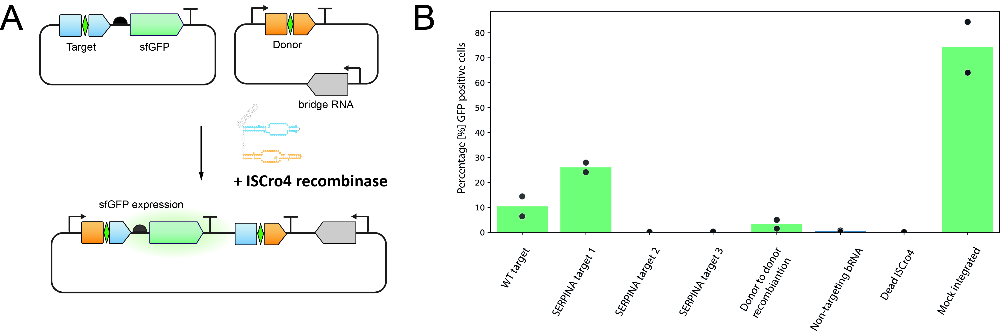
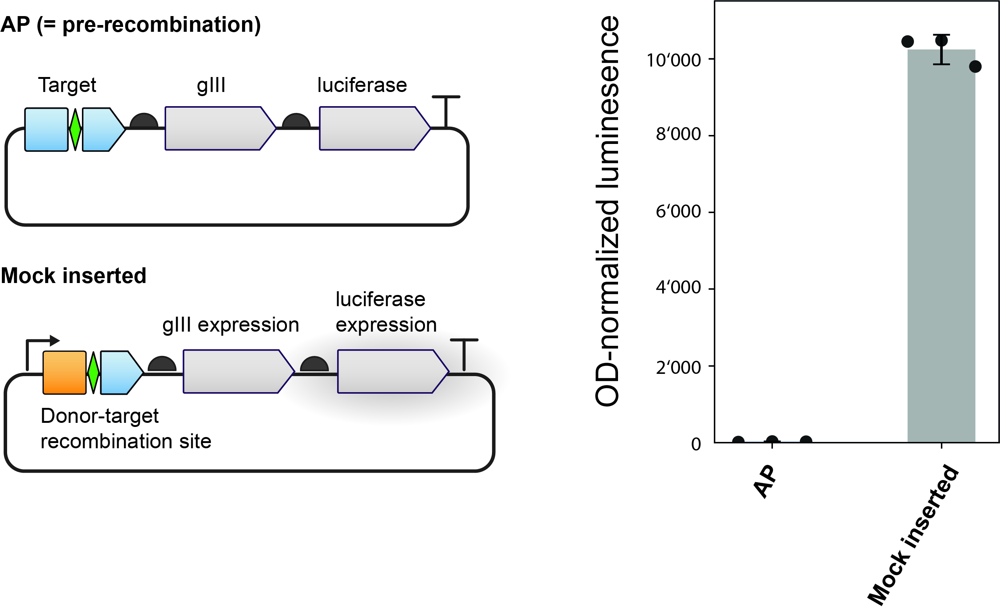
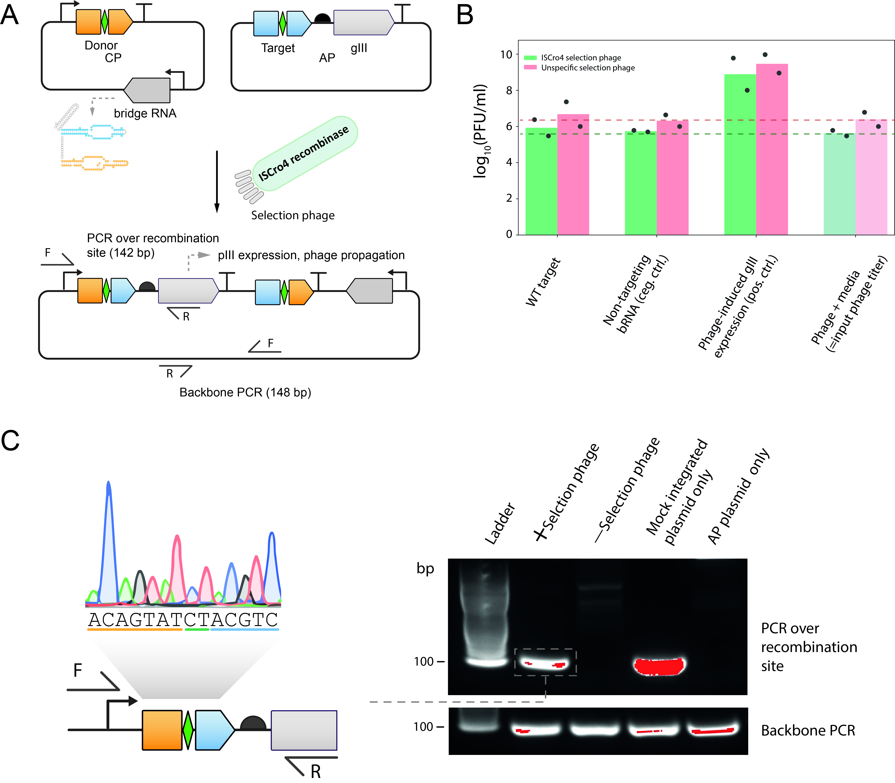

# PACE
## System for phage-assisted evolution of bridge recombinases
<figure markdown>

<figcaption> Figure 1: **Overview of phage-assisted continuous evolution (PACE) for bridge recombinase ISCro4:**
Selection phage (SP) carries the evolving ISCro4 recombinase but lacks *gIII*, which encodes the essential coat protein pIII. The host *E. coli* harbours three plasmids: (i) an accessory plasmid (AP) containing the target site plus *gIII* and a luciferase reporter that are promoterless; (ii) a complementary plasmid (CP) expressing the bRNA and donor sequence under an upstream promoter; and (iii) a mutagenesis plasmid (MP) [^PACE]. Upon successful insertion, the CP promoter is positioned immediately upstream of *gIII* (and luciferase), which drives pIII expression and enables replication of SPs encoding active recombinase variants. PACE is conducted in a fixed-volume “lagoon” with continuous dilution by fresh host cells, so only SPs that replicate faster than the dilution rate persist and evolve; ongoing mutation from the MP diversifies progeny for subsequent rounds of selection.
</figcaption>
</figure>

Although ISCro4 is highly active in human cells, its activity in *E. coli* has not been documented. To test whether ISCro4 can catalyse promoter-repositioning insertions (modelling the insertion needed to restore a healthy *SERPINA1* copy) in bacteria when paired with designed bRNAs, we constructed an sfGFP reporter that mirrors the PACE selection logic (Figure~\ref{fig:PACE_activity_assay}). In this system, sfGFP is carried on a low-copy plasmid with the recombination target site (either ISCro4 WT target, SERPINA1 target 1-3 (\ref{Sec:Target_selection}) or ISCro4 WT donor sequence)  upstream and no promoter - analogous to *gIII* on the AP - and is co-transformed with a CP encoding the bRNA and a promoter–donor cassette, together with an arabinose-inducible ISCro4 expression plasmid. 

Here we outline the rationale, design and preliminary testing of a insertion based phage-assisted continuous evolutions (PACE) [^PACE] logic for evolving bridge recombinases on the example of the ISCro4 bridge recombinase. 

The selection logic leverages the essential phage gene *gIII*, which encodes the coat protein pIII required for infectivity and replication. In our system (see Figure~\ref{fig:PACE_evolution_logic}A), the selection phage (SP) carries the evolving ISCro4 recombinase but does not contain *gIII*; as a consequence, SPs cannot replicate unless *gIII* is provided in trans by the host. To couple *gIII* expression tightly to successful recombination, the accessory plasmid (AP) carried by the host encodes *gIII* (and a luciferase reporter) without a promoter, and places the appropriate recombination target sequence upstream of these genes. A separate complementary plasmid (CP) encodes the bRNA and the donor sequence, and includes a promoter upstream of the donor. The intended recombination event moves that promoter into the correct position in front of *gIII* (and luciferase, when present). Thus, without recombination, there is no *gIII* expression and the SP cannot propagate; with successful recombination, the promoter is repositioned to drive pIII production, enabling replication of SPs that encode functional (and ideally improved) ISCro4 variants. In continuous culture, this design should favour variants that recombine efficiently at the programmed site, because only those variants gain access to pIII and can outcompete the dilution imposed by the lagoon flow.

<figure markdown>

<figcaption> Figure 2: **sfGFP activity assay for ISCro4 in* *E. coli*.**  
**A** Schematic of sfGPF activity assay. A low-copy plasmid carries sfGFP with its target site upstream and no promoter (AP-analog). The high-copy CP encodes the bRNA and a promoter–donor cassette. ISCro4 is expressed from an arabinose-inducible plasmid. Recombination repositions the CP promoter directly upstream of sfGFP, leading to sfGFP expression.  
**B** Flow-cytometry readout after \textasciitilde 20 h post arabinose induction at 37°C showing \%GFP-positive cells.
</figcaption>
</figure>

With this setup, we observed that wild-type ISCro4 catalyses insertion in *E. coli* in a recombinase- and bRNA-dependent manner: sfGFP activation was not detected with catalytically dead ISCro4 or with non-targeting bRNA controls. Moreover, bRNA reprogrammed to SERPINA target 1 exhibits activity above the wild-type target after 20 h after arabinose induction. While the precise percentage of GFP-positive cells depends on construct and growth conditions, these results establish that (i) ISCro4 is active in *E. coli* and (ii) activity can be redirected by designed bRNAs to non-native targets. Together, the sfGFP data support the feasibility of using the same promoter-repositioning logic to control *gIII* during selection. Although ISCro4 catalyses the intended donor–target insertion, prior work has also reported donor–donor recombination, a major potential source of off-target events [^Perry2025BridgeRecombinases]. To directly assess donor–donor activity, we modified the AP by replacing the upstream target site with a copy of the donor sequence. In line with the previously published data [^Perry2025BridgeRecombinases], ISCro4 exhibited donor-donor recombination.

To quantify the transcriptional gain produced by promoter repositioning and to validate that the post-recombination state strongly expresses *gIII*, we designed a mock-integrated plasmid that mimics the recombination product: the promoter is pre-installed upstream of *gIII*. On the same transcript downstream of *gIII*, a luciferase is expressed to enable a luminescent readout proportional to transcription through the *gIII*–lux cassette. When comparing strains carrying the pre-recombination configuration versus the mock-integrated (post-recombination) construct, we observed a \textasciitilde 10,000-fold (four-orders-of-magnitude) increase in luminescence for the mock-integrated state (Figure~\ref{fig:PACE_Luminescence_assay}), indicating a working transcription unit upon site-specific insertion.

<figure markdown>

<figcaption> Figure 3: **Validation of promoter repositioning:**  
The mock inserted plasmid mimics the post-recombination product which leads to constitutive *gIII* expression. Additionally, a luciferase gene placed downstream on the same transcript provides a luminescent readout proportional to transcription to *gIII*   Comparing the pre-recombination state and the mock inserted states reveals a \(\sim10^{4}\)-fold luminescence increase in the mock-integrated condition, confirming strong *gIII* transcription upon promoter repositioning in *E.\ coli* after 16-18 hours incubation at 37°C.
</figcaption>
</figure>

Having established activity and a transcriptional readout, we next asked whether the full selection logic supports phage propagation. We infected *E. coli* carrying the AP and CP with the ISCro4 selection phage (SP–ISCro4) and incubated cultures overnight (Figure~\ref{fig:PACE_phage_propagation_assay}A). As an initial test, we used WT ISCro4 with its cognate bRNA and quantified titres the following day. Under these conditions, no significant titre increase was observed relative to input phage titre and negative controls (non-targeting bRNA). Nonetheless, junction-specific PCR spanning the donor–target recombination site yielded the expected product, confirming that recombination occurred despite the lack of phage amplification.

<figure markdown>

<figcaption> Figure 3: **Overnight phage propagation assay with WT ISCro4:**  
**A** Setup: SP–ISCro4 (no *gIII*) infects hosts bearing AP (promoterless *gIII* + target) and CP (bRNA + promoter–donor); recombination should reposition the promoter to drive *gIII*.  
**B** Result: After overnight infection with SP–ISCro4, phage titers show no significant increase versus input phage titer and non-targeting bRNA negative controls; likewise for the unspecific selection phage expressing rpoZ. Positive control showes that SP–ISCro4 is capable of propagation when supplied with pIII in trans.  
**C** Validation: Junction PCR detects the expected donor–target product, confirming recombination despite the lack of phage amplification.
</figcaption>
</figure>

[^PACE]: Miller SM, Wang T, Liu DR. Phage-assisted continuous and non-continuous evolution. Nature Protocols. 2020;15(12):4101–4127. doi:10.1038/s41596-020-00410-3.
[^Perry2025BridgeRecombinases]: Perry NT, Bartie LJ, Katrekar D, Gonzalez GA, Durrant MG, Pai JJ, Fanton A, Martins JQ, Hiraizumi M, Ricci-Tam C, Nishimasu H, Konermann S, Hsu PD. Megabase-scale human genome rearrangement with programmable bridge recombinases. Science. 2025;:eadz0276. doi:10.1126/science.adz0276. PMID:40997214. Online ahead of print, 2025 Sep 25.

