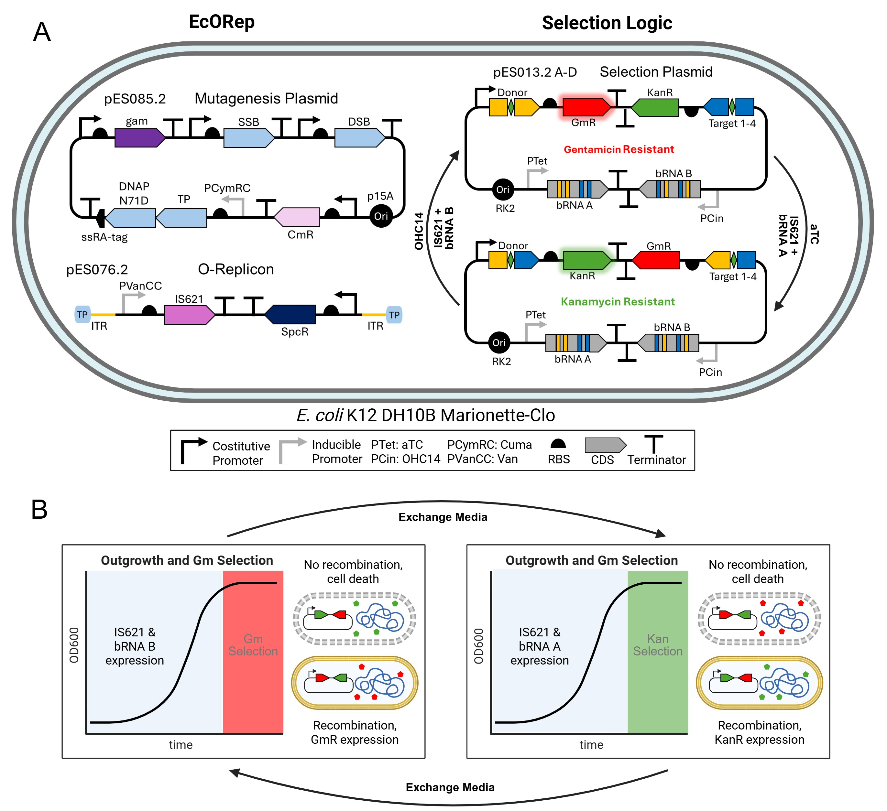
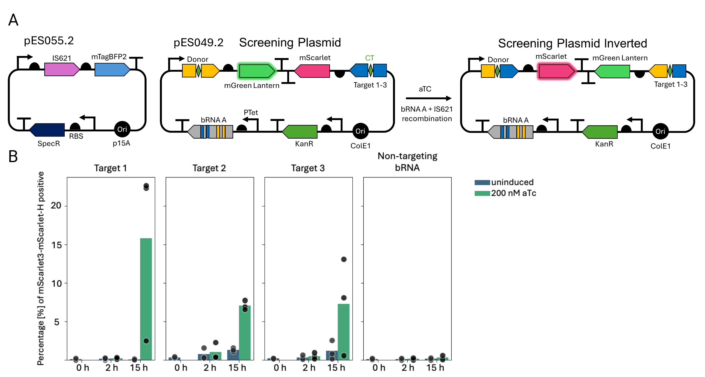
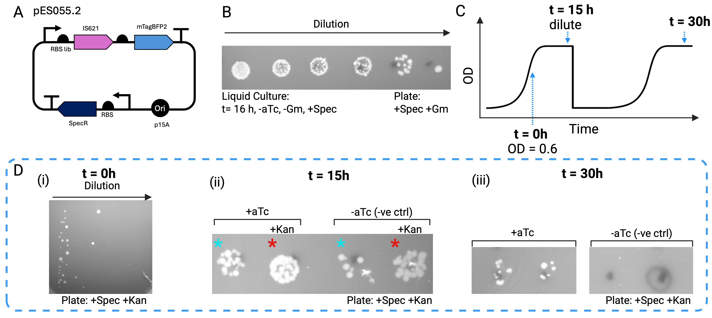
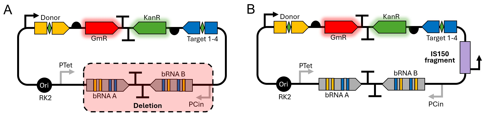
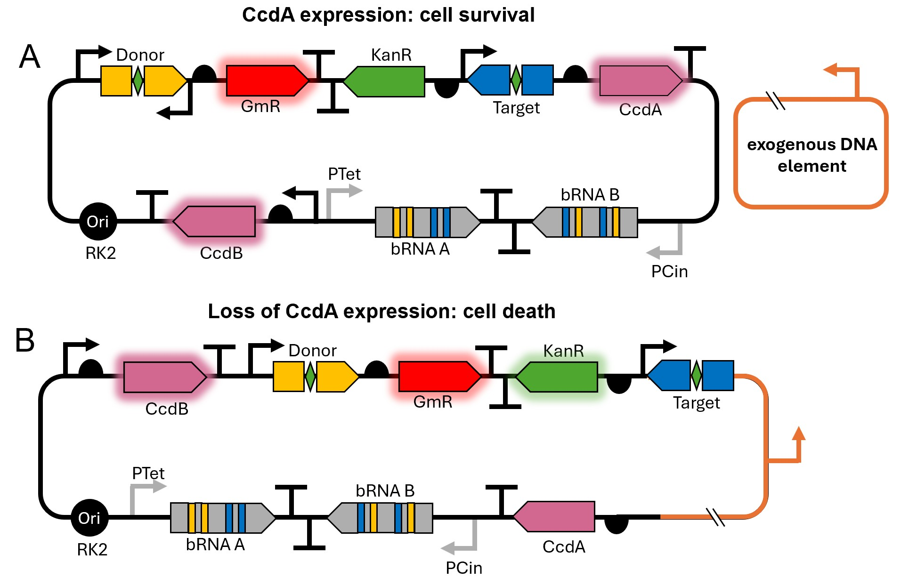

# Plasmid-based selection system for evolving bridge recombinases
## Evolutionary strategy and plasmid design
We designed an evolution logic that allows for the selection of improved bridge recombinases in *E. coli* (Figure 1). All components necessary for selection are contained on a single ”selection plasmid” while the bridge
recombinase is located on a different plasmid or orthogonal replicon. This system is adaptable to several continuous DE methods such as MutaT7 [^MutaT7], T7-ORACLE[^T7-ORACLE] and *E. coli* orthogonal replication system (EcORep)
[^EcORep]. Selection of variants with higher activity occurs as follows: the selection plasmid carries two bRNAs under the control of inducible promoters (Figure 1 A) and a cassette encoding two antibiotic resistance genes facing in opposite directions. This cassette can be inverted via bRNA-mediated recombination. Only one of the resistance genes is expressed in each of the orientations of the cassette. Therefore, it is possible to select for successful inversion of the cassette using antibiotics (Figure 1 B). This allows for the enrichment of recombinase variants with increased activity over time. Expression of bRNA A can be induced by the addition of anhydrotetracycline (aTc) and results in inversion of the cassette from its initial orientation (gentamycin (Gm) →kanamycin (Kan)). Expression of bRNA B is induced using N-(3-Hydroxytetradecanoyl)-DL-homoserine lactone (OHC14) and mediates the reverse process (Kan →Gm)

<figure markdown>
 
 <figcaption> Figure 1: DE of IS621 using EcORep. <strong>A</strong> depicts the mutagenesis plasmid, the O-Replicon and the selection
plasmid in an <em>E. coli</em> cell. The mutagenesis plasmid carries the genes necessary for replicating the O-Replicon.
The O-Replicon carries IS621 under the control of the inducible PVanCC promoter. The selection plasmid
contains a casette with two antibiotic resistances, Gm resistance (GmR) and Kan resistance (KanR) facing in
opposite directions. Depending on the orientation of the cassette, either GmR or KanR is transcribed. The
cassette is flanked by donor and target sequences facing each other. This allows for IS621 + bRNA mediated
inversion. <strong>B</strong> depicts the selection process. Cells are grown in LB liquid culture. IS621 expression is induced
using vanillic acid (Van). Shortly before stationary phase, bRNA expression is induced by addition of aTc for
bRNA A or OHC14 for bRNA B. Presence of IS621 + bRNA promotes recombination. Selection is performed
by regrowing cells in media containing Kan or Gm. Cells that have successfully recombined express the correct
AB resistance and survive, cells that did not recombine die. This process promotes the survival of bacteria
carrying more active IS621 variants.
</figcaption>
</figure>
 
EcORep is a continuous DE method that allows DE of large DNA segments in *E. coli*. EcORep uses genes
from PRD1 phage to replicate a linear orthogonal replicon (O-Replicon) with an increased mutation rate[^EcORep].
We attempted to adapt EcORep and use it for the evolution of IS621. IS621 is encoded on the O-replicon, which allows the generation of many variants in continuous culture. Expression of IS621 is controlled by the inducible PVanCC promoter. Cells that carry more active variants of IS621 are more likely to recombine during the time interval between bRNA induction and antibiotic (AB) addition. This results in enrichment of bacteria carrying more active recombinase variants. Selection takes place in the Marionette-Clo strain [^Marionette] which contains the regulators of all the inducible promoters used here. 

## Target Sequence Selection
As our proof-of-concept is to optimize bridge recombinase activity for AATD treatment, we identified three candidate target sequences (target 1-3) within the SERPINA1 locus. The targets were selected following these criteria: 

(i) 14 bp-long sequences with a CT core in intron 1 as nearly all disease causing mutations occur downstream of exon 1 [^ncbiSERPINA1]

(ii) excluded those with either direct match or 1 mismatch to any sequence in the _E. coli_ genome to reduce off targets

(iii) high similarity to the IS621 wild-type target sequence [^bridgeRecombinases]

To assess the baseline recombination efficiency between the wild-type donor and the selected target sequences, we co-expressed two plasmids in the _E. coli_ Marionette-Clo strain: one encoding the IS621 recombinase and another, the ”screening plasmid”, carrying the respective bRNA under the control of the PTet promoter along with two fluorescent reporter genes oriented in opposite directions (Figure 2A). 
The screening plasmid expresses mGreenLantern under the control of a constitutively active promoter; after inversion the two fluorescent reporter gene cassettes are flipped and mScarlet3 is placed downstream the promoter and expressed. The recombination efficiency for each target site is measured by flow cytometry and calculated as the percentage of mScarlet3-positive cells. Inversion is induced by addition of aTc which triggers bRNA A expression. 

After 15 h of induction targets 1-3 showed 6 % to 16 % of mScarlet3-positive cells, whereas, the non-targeted target-sequence showed < 1 % positive cells (Figure 2B), confirming target-specific inversion events. Similarly, we observed <1 % positive cells in the uninduced control in all conditions, except target 2 and 3, where we observed 2% positive cells at the 15 h time point. This is indicative of effective promoter repression in the absence of the inducer. Furthermore, we were only able to observe a change in fluorescent protein expression after 15 hours of induction, as there were <1 % mScarlet positive cells 2 hours after induction across all conditions. Lastly, flipping events were confirmed by Oxford Nanopore sequencing. Target 1 showed the highest activity and was selected as the primary target sequence from this point forward.

<figure markdown>

<figcaption>Figure 2: Flow cytometry analysis and sequencing validation of IS621 recombination activity between the wild-
type donor and the targets identified within the SERPINA1 locus.<strong>A</strong> Schematic representation of the plasmids
used in the flow cytometry analysis. pES049.2 contains the bRNA targeting the respective target sequence under the control of PTet promoter
and the two fluorescent reporter genes, mGreenLantern and mScarlet3, facing in opposite directions. These
are flanked by donor and target sequences to allow for IS621 + bRNA mediated flipping. pES055.2 contains
IS621 followed by mTagBFP2 to facilitate the gating of cells bearing both plasmids. Induction with aTc leads
to expression of the bRNA and therefore recombination. <strong>B</strong> Percentage of mScarlet3-positive cells over the
number of cells expressing both IS621 recombinase and the fluorescent reporter plasmid. Marionette-Clo cells
carrying plasmids pES049.2 and pES055.2 were either uninduced (blue) or induced (green) with 200 nM aTc
for the indicated times before the analysis. Bars indicate mean values of three replicates, with individual data
points shown. Each panel represents a different target sequence (1, 2 or 3). The non-targeting bRNA condition
corresponds to cells carrying pES055.2 and pES049.2 bearing bRNA 1 and target sequence 2, serving as a
negative control.
</figcaption>
</figure>

## Validation of the selection logic 
To identify optimal induction and selection conditions for detecting IS621-mediated inversions, we screened
nearly 100 conditions, with the most promising ones discussed below. We co-transformed the selection plasmid (pES013.2A) with a plasmid constitutively expressing IS621 (pES055.2). In this simplified model system, inversion is induced by the addition of aTc leading to the expression of the bRNA A. We first showed that the bacterial population maintains the selection plasmid in the absence of antibiotic selection by Gm or Kan in liquid culture over the course of 15 h (Figure 3 A). Based on this, we devised the induction scheme showed in Figure 3 C.

The bacterial population was induced in late exponential phase (OD600O=0.6). We tested two different conditions: 

 1. No antibiotic after induction
    
 2. Kanamycin added after aTc induction to select for succesful inversions of the antibiotic cassette. 
    
For each condition, controls in which bRNA expression was not induced were included. 
Bacteria were grown for 15 hours after induction and then, those grown in absence of Kan were diluted into fresh media and grown for an additional 15 hours. This allowed for a longer induction period while minimizing cell death. 
Notably, some bacterial colonies were already able to grow on Kan plates before induction (t=0), indicating a low level of pre-existing resistance in the native population (Figure 3 D (i)).

<figure markdown>
 
<figcaption>Figure 3: Phenotypic selection for successful inversion by IS621 following induction of bRNA expression with
aTc. <strong>A</strong> Phenotypic selection for successful inversion by IS621 following induction of bRNA expression with
aTc. <strong>B</strong> Serial dilution droplet plating of the strain carrying
pES055.2 and pES013.2A (see Figure 2) after 15 h growth in absence of Gm on Gm/Spec plates. **C** Schematic
representation of the induction and growth conditions of bacteria containing the selection plasmid and constitu-
tively expressing IS621. The cells were induced with aTc at an OD600O=0.6=0.6 either in the absence or presence of
Kan. The cultures were diluted in fresh media after 15 h and grown for an additional 15 h. **D** Bacte-
rial growth on Kan/Spec plates after 0 h, 15 h and 30 hours after induction and antibiotic
selection. (i) Serial dilution of the bacterial culture before induction, (ii) induced samples with their respective
negative controls, sample and control indicated with coloured asterics (No selection with Kan in liquid cultures
(cyan), with Kan in liquid culture (red)). Cultures grown with Kan were terminated after 15 h, (iii) induced
samples grown in abscence of Kan for 30 h plated as droplets in duplicate. Black markings on plates indicate
the position of bacterial droplet when plated.
</figcaption>
</figure>

Following this assay monoclonal cultures were grown and their DNA sequenced. While the sequencing data confirmed inversion of the AB cassette, it also detected escape mutations, in some of the colonies grown in the presence of Kan.
Two escape mutations were identified: large deletions as well as insertions of genomic host DNA. 
Upon deletion KanR gene was placed under the control of the pTet promoter, which otherwise controls bRNA A expression, enabling cell surivival without inversion of the cassette (Figure 5 A). 
The second escape mutation we observed was a partial insertion of the transposable element IS150 from IS3 family [^trasposon]. This fragment contains a promoter which leads to the expression of KanR and cell survival (Figure 5 B).

<figure markdown>
 
<figcaption>Figure 4: Schematic of escape mutants. In the unmodified selection plasmid, the resistance cassette is under the
control of only one promoter. Gene deletion <strong>A</strong>, off-target recombination or insertion of an exogenous gene
sequence <strong>B</strong> may lead to re-localization of a second promoter downstream of the cassette. This can lead to the
formation of escape mutants. Escape mutants express GmR and KanR simultaneously and thus no longer need
to flip the cassette for survival during selection. During our selection experiments we found two escape mutants.
One showed a large deletion. Both bRNAs where absent from the plasmid and the KanR gene was under the
control of the PTet promoter. The the other escape mutants carried a fragment of IS150. The IS150 fragment
contains an additional promoter and supports KanR expression.
</figcaption>
</figure>

These escape mutations represent a limit for the applicability of our system, as they allow cells to grow without the need for IS621-catalysed recombination.
To counteract this, we have devised an experimental strategy which aims to reduce the number of possible escape mutations. Escape mutants as shown if Figure 4 appear when a promoter is re-localized and the simultaneous transcription of GmR and KanR are enabled. This renders inversion of the AB cassette unnecessary. The incorporation of CcdA/CcdB toxin/antitoxin system into the selection plasmid as shown in Figure 5 should greatly reduce the number of escape mutants. The toxin CcdB inhibits DNA gyrase, an essential enzyme that can introduce negative supercoils in the DNA during replication. Loss of gyrase activity results in cell death. The antitoxin CcdA binds CcdB and neutralizes the toxic effects. [^CcdA-CcdB] In our proposed system, both CcdA and CcdB are constitutively expressed. CcdA is located downstream of the AB cassette. Transcription of CcdA is initiated form one of two promoters within the AB cassette, depending on the orientation of the cassette. Insertion, deletion or off target recombination events that can lead to the formation of escape mutants in the previous system (pES013.2). In the ajdusted system, such events should result in the loss of CcdA transcription, which leads to cell death. 

<figure markdown>
 
<figcaption>Figure 5: Introduction of the CcdA/CcdB toxin/antitoxin system in the selection plasmid to reduce the number
of possible escape mutants. <strong>A</strong> Native configuration of the selection plasmid with the integrated CcdA/CcDB
toxin/antitoxin system. Expression of CcdA suppresses CcdB toxicity. <strong>B</strong> Relocalization of the second promoter
downstream of the cassette leads to loss of CcdA expression and cell death.
</figcaption>
</figure>

As a next step we aim to demonstrate inversion in the reverse direction (Kan --> Gm) following induction of
the bRNA. Successful implementation of this step would enable continuous directed evolution. This could involve growing the bacteria in a continuous culture where the media is exchanged slowly overtime to contain different concentrations of the inducers and antibiotics used for selection. Alternately, non-continuous cultures can be used where the bacteria are subjected to iterative cycles of induction and selection.

## Directed Evolution of IS621 using EcORep
We attempted to apply our evolutionary logic in combination with EcoRep. This system allows for an orthog-
onally increased mutation rate on the target gene in vivo [^EcORep].
Since we were unable to obtain the EcORep strain, we set out to engineer an adapted version of EcORep. Our
goal was to create a system that carries all the genes necessary for stable replication of the O-Replicon on a single
plasmid. The original system works as follows: A synthetic replication operon containing the PRD1 genes TP
(pVIII), DNAP (pI), SSB (pXII) and DSB (pXIX) is integrated in the _E. coli_ strain DH10B. The operon is under
the control of the IPTG-responsive Ptac promoter. To establish the O-Replicon, the strain is first transformed
with an additional ”helper plasmid” (pFR160GB) expressing SSB, DSB and Gam. The O-Replicon is then
electroporated into this strain. The helper plasmid can then be cured from the strain. To expand and mutagenize
the O-Replicon, the genomically integrated casette is repressed using a plasmid (pRT19) carrying dCas9 and
gRNA targeted to the IPTG promoter. An additional plasmid expressing the PRD1 genes including a mutagenic
version of DNAP (N71D), is expressed from another plasmid (pRT4-2). In our simplified design (pES084.2,
17), all genes necessary necessary for replication of the O-Replicon are carried on a low copy plasmid with the
p15A ori. The TP and mutagenic DNAP-N71D are under the control of the PCymRC promoter optimized by
Meyer et al.[^Marionette] This inducible promoter shows a great dynamic range and low leakiness. Expression in the
induced state is 870 fold higher. Furthermore, we tried to optimize the expression levels of SSB, DSB, and
Gam by creating a promoter and RBS library for each of the genes. This plasmid-borne system can easily be
transformed. The reduced number of genetic components should also decrease the metabolic burden of carrying
the system. Unfortunately, we have not been able to test our selection strategy with the EcoRep system within the time frame of our project. However, the selection logic is not directly linked to the method of gene diversification. Consequently, the system should work in combination
with EcORep given that both systems have been shown to work independantly. The selection could also be employed in combination with any other DE method as long as selection takes place in vivo. Furthermore, the strategy requires only simple laboratory equipment.
    
## Markdown footnotes for citations
[^MutaT7]: A. A. Mengiste, J. L. McDonald, M. T. Nguyen Tran, et al., “MutaT7GDE: A Single Chimera for the
Targeted, Balanced, Efficient, and Processive Installation of All Possible Transition Mutations In Vivo,”
ACS Synthetic Biology, vol. 13, no. 9, pp. 2693–2701, Sep. 2024, Publisher: American Chemical Society.
doi: 10.1021/acssynbio.4c00316. (visited on 04/30/2025).
[^T7-ORACLE]: C. S. Diercks, P. Sondermann, C. Rong, et al., “An orthogonal T7 replisome for continuous hypermutation
and accelerated evolution in E. coli,” Science, vol. 389, no. 6760, pp. 618–622, Aug. 2025, Publisher:
American Association for the Advancement of Science. doi: 10.1126/science.adp9583. (visited on
09/19/2025).
[^EcORep]: R. Tian, F. B. H. Rehm, D. Czernecki, et al., “Establishing a synthetic orthogonal replication system
enables accelerated evolution in E. coli,” Science, vol. 383, no. 6681, pp. 421–426, Jan. 2024, Publisher:
American Association for the Advancement of Science. doi: 10.1126/science.adk1281. (visited on
05/21/2025).
[^Marionette]: A. J. Meyer, T. H. Segall-Shapiro, E. Glassey, J. Zhang, and C. A. Voigt, “Escherichia coli “Marionette”
strains with 12 highly optimized small-molecule sensors,” en, Nature Chemical Biology, vol. 15, no. 2,
pp. 196–204, Feb. 2019, Publisher: Nature Publishing Group, issn: 1552-4469. doi: 10.1038/s41589-
018-0168-3. (visited on 04/12/2025).
[^ncbiSERPINA1]: “SERPINA1: Chr14 - Genome Data Viewer - NCBI.” Accessed: Oct. 08, 2025. Available: https://www.ncbi.nlm.nih.gov/gdv/browser/gene/?id=5265
[^bridgeRecombinases]: M. G. Durrant, N. T. Perry, J. J. Pai, et al., “Bridge RNAs direct programmable recombination of target
and donor DNA,” Nature, vol. 630, no. 8018, pp. 984–993, Jun. 2024, Epub 2024 Jun 26. doi: 10.1038/
s41586-024-07552-4.
[^trasposon]:M. Haas and B. Rak, “Escherichia coli insertion sequence is150: Transposition via circular and linear
intermediates,” Journal of Bacteriology, vol. 184, no. 21, pp. 5833–5841, 2002. doi: 10.1128/JB.184.
21.5833-5841.2002
[^CcdA-CcdB]: N. D. Jonge, A. Garcia-Pino, L. Buts, et al., “Rejuvenation of CcdB-Poisoned Gyrase by an Intrinsically
Disordered Protein Domain,” English, Molecular Cell, vol. 35, no. 2, pp. 154–163, Jul. 2009, Publisher:
Elsevier, issn: 1097-2765. doi: 10.1016/j.molcel.2009.05.025. (visited on 10/08/2025).

