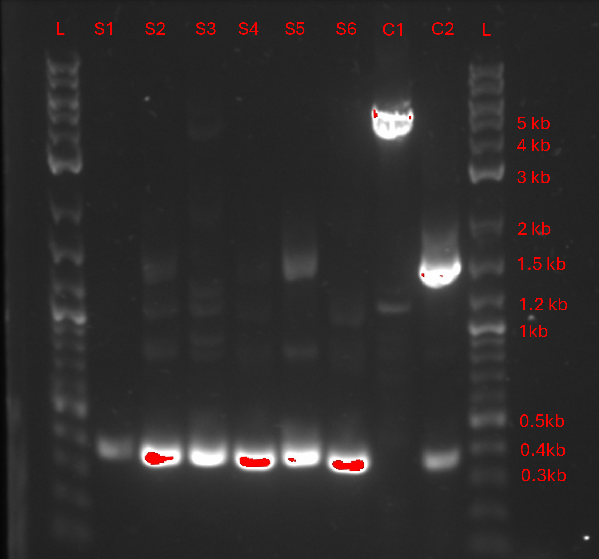

# sEM6 Strain generation

## Background

Bacteria can form biofilms theese biofilms can potentially interfere with our directed evolution efforts. The csg operon was deleted to prevent biofilm formation [^yan_3]. The deletion was done using lambda red recombineering as described here [^jensen_1].

## How it was done

The strain was generated using lambda red recombineering using pSIJ8 [^jensen_1] to delete the csg operon from Marionette-Clo (sAJM.1504) [^meyer_2].  Fresh cultures of Marionette-Clo were grown to an OD600 of 0.3 and then induced with 15 mM L-arabinose (final concentration) for an hour. Subsequently the cells were made electrocompetent. The linear dsDNA (see Table 2) was electroporated in to the cells. Then they were recovered and plated. Six colonies were picked the following day and liquid cultures were set up. Finally the fliptase was induced in theese liquid cultures with 50 mM L-rhamnose (final concentration) and grown at 38°C to cure pSIJ8. The deletion was validated using colony PCR . The cultures from the single colonies are designated S1-S6 (see Figure 13).

## Validation by qPCR

<figure markdown>

<figcaption> 
</figcaption>
</figure>

1% agarose gel of a colony PCR done with the csg primers (see Table2). S1-S6 as described in
methods. Lanes L are ladders made with NEB 1kb plus. C1 is Marionette-Clo. C2 is a sample before the
induction of the fliptase. The amplicon size for the csg primer pair in Marionette-Clo is 4.8 kb. This matches
well with lane C1. Validating that the primers work. The amplicon size for Marionette-Clo with the integrated
dsDNA substrate is 1.5 kb. This is seen in C2, thus confirming the successful integration of the dsDNA substrate. After the resistance cassette is flipped out, the amplicon is expected to be roughly 400 bp. This can be observed in S1-S6. Meaning that the deletion has successfully worked.

## Genomeseq

[^jensen_1]: S. I. Jensen, R. M. Lennen, M. J. Herrgård, and A. T. Nielsen, “Seven gene deletions in seven days: Fast generation of escherichia coli strains tolerant to acetate and osmotic stress,” Scientific Reports, vol. 5, no. 17874, 2016. doi: 10.1038/srep17874.
[^meyer_2]: A. J. Meyer, T. H. Segall-Shapiro, E. Glassey, J. Zhang, and C. A. Voigt, “Escherichia coli “Marionette” strains with 12 highly optimized small-molecule sensors,” en, Nature Chemical Biology, vol. 15, no. 2, pp. 196–204, Feb. 2019, Publisher: Nature Publishing Group, issn: 1552-4469. doi: 10.1038/s41589-018-0168-3. (visited on 04/12/2025).
[^yan_3]: C.-H. Yan, F.-H. Chen, Y.-L. Yang, et al., “The transcription factor CsgD contributes to engineered escherichia coli resistance by regulating biofilm formation and stress responses,” International Journal of Molecular Sciences, vol. 24, no. 18, p. 13 681, Sep. 5, 2023, issn: 1422-0067. doi: 10.3390/ijms241813681. (visited on 09/29/2025).